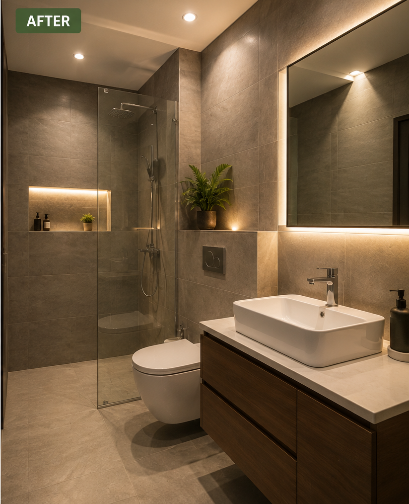
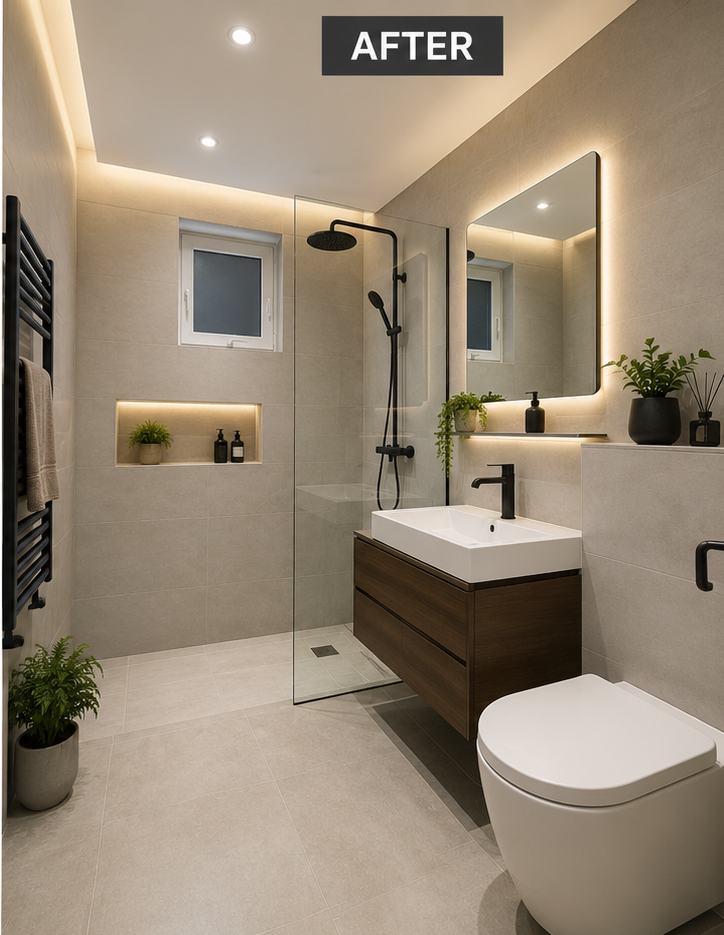
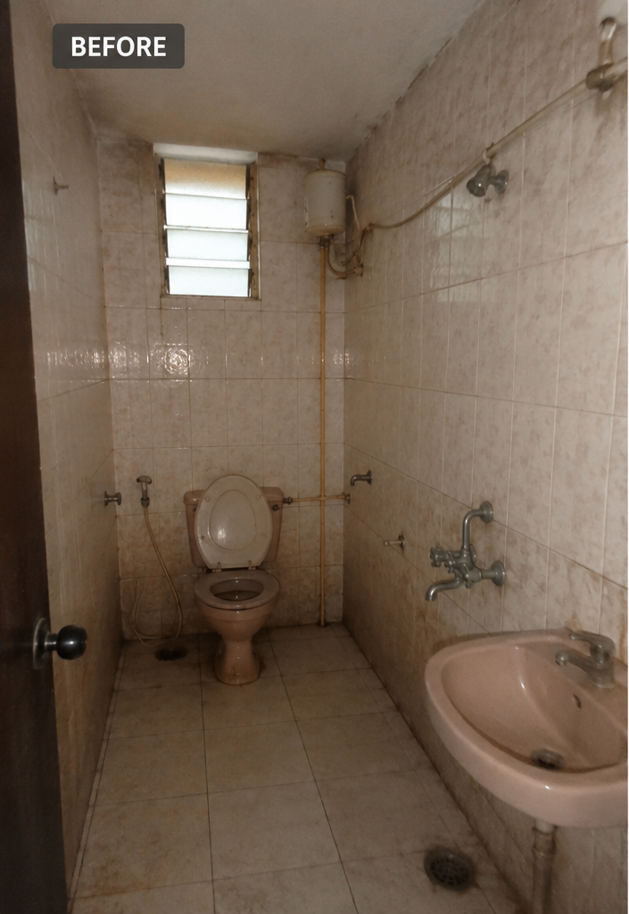
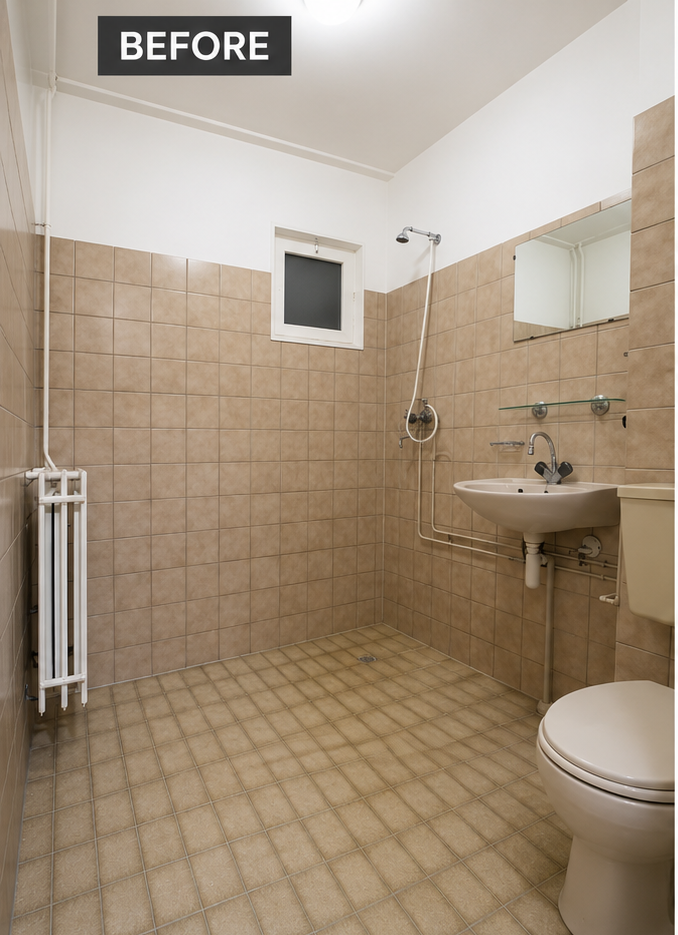

# 🛁 Brick & Bath — Luxury Bathroom Renovation Platform

<div align="center">


# **BRICK & BATH**
### ✨ *BATHROOM MEETS LIFESTYLE* ✨
*Powered by Bricknbar • Odisha's Premier Turnkey Renovation Platform*

<p align="center">
  <a href="https://brick-bath.vercel.app" target="_blank">
    
  </a>
  <a href="https://brick-bath.vercel.app/owner-login.html" target="_blank">
    
  </a>
  <a href="https://brick-bath.vercel.app/api/health" target="_blank">
    
  </a>
</p>

[](https://brick-bath.vercel.app)
[](https://nodejs.org/)
[](https://expressjs.com/)
[](https://www.mongodb.com/atlas)
[](https://www.sqlite.org/)
[](https://jwt.io/)
[](https://brick-bath.vercel.app/#process)
[](https://brick-bath.vercel.app/#guarantee)

<br/>

<a href="https://brick-bath.vercel.app" target="_blank">
  
</a>

<br/><br/>

### 📍 [Explore Live Website](https://brick-bath.vercel.app) • 🔐 [Owner Portal](https://brick-bath.vercel.app/owner-login.html) • 📋 [Inquiries CRM](https://brick-bath.vercel.app/inquiries.html) • 📡 [API Endpoints](#-rest-api-documentation) • 🚀 [Quickstart](#-local-development-setup)

---

</div>

## 📑 Table of Contents

- [🌟 Live Deployments & Portals](#-live-deployments--portals)
- [📖 Executive Overview](#-executive-overview)
- [💎 Feature Highlights](#-feature-highlights)
- [📸 Visual Showcase & Previews](#-visual-showcase--previews)
  - [Split-Screen Before & After Transformations](#-before--after-transformations)
  - [Turnkey Luxury Collections](#-turnkey-luxury-collections)
  - [Executive Owner Portal & Lead Pipeline](#-executive-owner-portal--crm)
- [🏛️ System Architecture](#️-system-architecture)
- [🗄️ Dual-Engine Database Reliability](#️-dual-engine-database-reliability)
- [📡 REST API Documentation](#-rest-api-documentation)
- [🔐 Demo Owner Credentials](#-demo-owner-credentials)
- [⚙️ Environment Variables Reference](#️-environment-variables-reference)
- [🚀 Local Development Setup](#-local-development-setup)
- [☁️ Deployment to Vercel](#️-deployment-to-vercel)
- [📱 Contact & Experience Center](#-contact--experience-center)
- [👩‍💻 Author](#-author)

---

## 🌟 Live Deployments & Portals

The application is deployed live with high availability on **Vercel's Global Edge Network** paired with **MongoDB Atlas Cloud Database**:

| Portal / Resource | Live URL | Access Level | Description |
| :--- | :--- | :--- | :--- |
| **🌐 Client Digital Showroom** | [https://brick-bath.vercel.app](https://brick-bath.vercel.app) | Public | Customer-facing luxury showroom, interactive turnkey cost estimator, 3D gallery, lookbook & consultation booking. |
| **🔐 Owner Portal Login** | [https://brick-bath.vercel.app/owner-login.html](https://brick-bath.vercel.app/owner-login.html) | Owner Auth | Cryptographically verified JWT login gateway for executives and administrators. |
| **📊 Lead Management CRM** | [https://brick-bath.vercel.app/inquiries.html](https://brick-bath.vercel.app/inquiries.html) | 🔒 Protected | Real-time consultation ledger with 5-stage lifecycle pipeline, note tracking, WhatsApp triggers & CSV export. |
| **🩺 Backend API Health Status** | [https://brick-bath.vercel.app/api/health](https://brick-bath.vercel.app/api/health) | Public | Real-time diagnostics endpoint showing MongoDB Atlas connection state, version, and serverless uptime. |
| **🌍 Official Domain Alias** | [https://www.bricknbath.com](https://www.bricknbath.com) | Canonical | Production domain mapped with SSL & dynamic SEO sitemaps. |

---

## 📖 Executive Overview

**Brick & Bath** (powered by *Bricknbar*) redefines luxury interior design and turnkey bathroom construction across Odisha (Bhubaneswar, Cuttack, Puri). 

Traditional bathroom remodeling is plagued by vendor fragmentation, uncertain pricing, recurring waterproofing leakages, and delayed project timelines. **Brick & Bath** solves this with a modern full-stack web platform combining:
1. **Interactive 3D Visualizer & Turnkey Package Estimator** for instant, transparent pricing.
2. **21-Day Guaranteed Turnaround** backed by certified 7-layer waterproofing protocols.
3. **Enterprise Executive Owner Portal** featuring an automated 5-stage customer lifecycle pipeline and consultation CRM.
4. **Dual-Engine Resilient Database Architecture** using **MongoDB Atlas** with automatic fallback to **SQLite**.

---

## 💎 Feature Highlights

### 🎨 Client-Facing Digital Showroom (`index.html`)
* **Luxury Architectural Design System:** Tailored dark-mode canvas (`#070A0F`, `#0B111A`) with brushed champagne gold accents (`#C59D42`), subtle glassmorphism, and Bodoni Moda / Outfit typography.
* **Interactive Before & After Slider:** Split-screen slider comparing real renovation projects with drag and touch support.
* **Dynamic Turnkey Cost Estimator:** Real-time pricing engine calculating quotes based on bathroom type (*Master, Guest, Powder*), scope (*Turnkey, Wet Area, Cosmetic*), and collection tier (*Aura, Prestige, Elite, Signature*).
* **Digital Lookbook & Flipbook Viewer:** Interactive viewer showcasing curated Italian marble, concealed sanitaryware, and smart fittings.
* **Smart Multi-Step Consultation Scheduler:** Validates client details, dates, and requirements, instantly persisting records to MongoDB Atlas and alerting the design team.
* **Live Material & Moodboard Switcher:** Real-time preview of Italian Calacatta, Nero Marquina, fluted tiles, and matte black/rose gold sanitary finishes.
* **Direct WhatsApp Concierge:** Instant pre-formatted chat integration connected directly with senior architectural engineers.

---

### 🔐 Executive Owner Portal & CRM (`owner-login.html` & `inquiries.html`)
* **JWT-Protected Security Layer:** Strict credential verification issuing cryptographically signed tokens with 24-hour expiration.
* **5-Stage Lead Lifecycle Pipeline:**
  * 🟡 **`New`** — Fresh consultation submitted from the website.
  * 🔵 **`Contacted`** — Preliminary requirements consultation completed.
  * 🟣 **`Assessment Scheduled`** — On-site 3D laser measurement booked.
  * 🟠 **`Quotation Sent`** — Architectural proposal and 3D render delivered.
  * 🟢 **`Converted`** — Turnkey contract signed, site work initialized.
* **Live Database Search & Dynamic Filtering:** Filter by status, date, budget, or search customer name, phone, or reference ID.
* **Internal Architect Notes:** Add private project remarks, site constraints, and material specifications directly to each client file.
* **One-Click Instant Communications:** Direct click-to-call and pre-filled WhatsApp responses for rapid follow-ups.
* **One-Click CSV/Excel Data Export:** Download customer records for offline reporting and spreadsheet analysis.

---

## 📸 Visual Showcase & Previews

### 🔄 Before & After Transformations
Experience the high-impact before-and-after transformations delivered by Brick & Bath turnkey renovations:

| Project #1: Master Suite Remodel | Project #2: Luxury Powder Room |
| :---: | :---: |
| <br><sub>✨ **After:** Italian Marble & Concealed Fixtures</sub> | <br><sub>✨ **After:** Fluted Glass & Ambient Backlighting</sub> |
| <br><sub>⚠️ **Before:** Outdated Tiles & Exposed Plumbing</sub> | <br><sub>⚠️ **Before:** Compact & Poorly Ventilated Space</sub> |

---

### 🏛️ Turnkey Luxury Collections

<div align="center">

| Collection | Description | Finish & Fittings |
| :--- | :--- | :--- |
| **Aura Minimalist** | Clean lines, concealed sanitaryware, anti-fingerprint matte finishes, and warm perimeter lighting. | Matte Black / Jaquar Artize |
| **Prestige Elegance** | Large format glazed vitrified slabs, brushed gold accents, thermostatic rain showers, and fluted vanity units. | Brushed Champagne Gold / Kohler |
| **Elite Wellness Spa** | Aromatherapy steam showers, freestanding quartz soaking tubs, heated anti-fog smart mirrors, and wall-hung sensor WCs. | Rose Gold / Grohe Spa |
| **Signature Bespoke** | Bookmatched imported Italian Calacatta marble, smart touch automation, sensor faucets, and tailor-made bespoke vanity cabinetry. | Brushed PVD Platinum / TOTO Neorest |

</div>

---

## 🏛️ System Architecture

```mermaid
graph TD
    Client([Client / Homeowner]) -->|Browse & Calculate Estimates| VercelEdge[Vercel Global Edge CDN]
    Owner([Architect / Owner]) -->|Authenticate via JWT| VercelEdge

    VercelEdge --> Static[Static Assets: HTML5, CSS3, ES6 Modules]
    VercelEdge -->|/api/* Calls| Serverless[Express.js Serverless Microservices]

    subgraph Backend Microservices
        Serverless --> Auth[JWT Token Authentication & Verification]
        Serverless --> Inquiries[Inquiry & CRM Pipeline Manager]
        Serverless --> Careers[Talent Application Engine]
        Serverless --> Health[Real-Time System Diagnostics]
    end

    subgraph Resilient Dual-Engine Database
        Serverless -->|Primary Driver (Cached Connection)| MongoAtlas[(MongoDB Atlas Cloud Replica Set)]
        Serverless -.->|Automatic Failover| SQLite[(Local SQLite Database)]
    end

    subgraph Notifications & Integrations
        Inquiries --> WhatsApp[WhatsApp Direct API Concierge]
        Inquiries --> Nodemailer[SMTP Mailer Engine / Gmail Alerts]
    end
```

---

## 🗄️ Dual-Engine Database Reliability

To guarantee **100% zero-lead loss** even during external network interruptions, Brick & Bath implements an automatic dual-database failover pattern:

| Engine | Role | Target Environment | Purpose |
| :--- | :--- | :--- | :--- |
| 🍃 **MongoDB Atlas** | **Primary Cloud Database** | Vercel Serverless & Production | Highly-scalable cloud cluster storing customer consultations, lifecycle state, timestamps, and architectural notes. |
| 🗃️ **SQLite Engine** | **Local & Fail-Safe Fallback** | Local Dev & Standalone Mode | High-speed embedded SQL database ensuring the system remains operational even when cloud connectivity is unavailable. |

---

## 📡 REST API Documentation

### 📋 Inquiries & Consultation CRM (`/api/inquiries`)

| Method | Endpoint | Access Level | Description |
| :--- | :--- | :--- | :--- |
| `POST` | `/api/inquiries` | Public | Submit new consultation lead with package details, date & phone. |
| `GET` | `/api/inquiries` | 🔒 Owner | Retrieve all consultation leads with optional keyword and status search. |
| `GET` | `/api/inquiries/:refId` | Public | Lookup inquiry information by Reference ID (e.g., `#BNB-2026-XXXX`). |
| `PATCH` | `/api/inquiries/:id` | 🔒 Owner | Update status (`New` ➔ `Contacted` ➔ `Converted`) or add internal notes. |
| `DELETE` | `/api/inquiries/:id` | 🔒 Owner | Permanently remove or archive a consultation document. |
| `GET` | `/api/inquiries/stats` | 🔒 Owner | Retrieve real-time metrics, active leads, and conversion ratios. |
| `GET` | `/api/inquiries/export/csv` | 🔒 Owner | Download consultation records as a structured `.csv` spreadsheet. |

---

### 🔑 Authentication (`/api/auth`)

| Method | Endpoint | Access Level | Description |
| :--- | :--- | :--- | :--- |
| `POST` | `/api/auth/login` | Public | Verify credentials and receive a signed JWT bearer token. |
| `GET` | `/api/auth/verify` | 🔒 Owner | Verify active JWT token validity and session status. |

---

### 💼 Careers (`/api/careers`)

| Method | Endpoint | Access Level | Description |
| :--- | :--- | :--- | :--- |
| `POST` | `/api/careers` | Public | Submit job applications for Site Engineers, 3D Designers, and Architects. |
| `GET` | `/api/careers` | 🔒 Owner | View submitted talent applications and portfolio links. |

---

### 🩺 System Diagnostics (`/api/health`)

| Method | Endpoint | Access Level | Description |
| :--- | :--- | :--- | :--- |
| `GET` | `/api/health` | Public | View live status of backend services and MongoDB Atlas connection. |

---

## 🔐 Demo Owner Credentials

To test the **Executive Owner Portal** on the live deployment:

* **Portal URL:** [https://brick-bath.vercel.app/owner-login.html](https://brick-bath.vercel.app/owner-login.html)
* **Username:** `admin`
* **Password:** `rudra1234`

> [!NOTE]  
> Once authenticated, tokens are securely stored in `localStorage` and sent via `Authorization: Bearer <TOKEN>` on all subsequent CRM requests.

---

## ⚙️ Environment Variables Reference

Create a `.env` file in the root directory based on `.env.example`:

```ini
# Application Port & Node Environment
PORT=5000
NODE_ENV=production

# MongoDB Atlas Cloud Database URI
MONGODB_URI=mongodb+srv://<username>:<password>@cluster.mongodb.net/bricknbath?retryWrites=true&w=majority

# Local SQLite Fail-Safe Database Path
DB_PATH=./backend/data/bricknbath.sqlite

# Owner Authentication Secrets
OWNER_USERNAME=admin
OWNER_PASSWORD=rudra1234
JWT_SECRET=bnb_luxury_jwt_secret_super_secure_key_2026
JWT_EXPIRY=24h

# Email Notification Service (Gmail SMTP)
OWNER_EMAIL=contact@bricknbath.com
SMTP_HOST=smtp.gmail.com
SMTP_PORT=465
SMTP_SECURE=true
SMTP_USER=your_email@gmail.com
SMTP_PASS=your_16_digit_google_app_password
```

---

## 🚀 Local Development Setup

### 1. Prerequisites
* **Node.js** >= 18.x (Recommended: Node 22 LTS)
* **npm** >= 9.x
* **Git**

### 2. Clone the Repository
```bash
git clone git@github.com:bijayalaxmilenka2002/Brick-Bath.git
cd Brick-Bath
```

### 3. Install Dependencies
```bash
npm install
```

### 4. Configure Environment
```bash
cp .env.example .env
# Edit .env with your preferred MongoDB URI or local settings
```

### 5. Launch the Server
```bash
npm start
```

* **Client Showroom:** `http://localhost:5000`
* **Owner Portal:** `http://localhost:5000/owner-login.html`
* **Health Check:** `http://localhost:5000/api/health`

---

## ☁️ Deployment to Vercel

This repository is pre-configured with **`vercel.json`** and **`api/index.js`** for instant serverless execution:

1. Push your latest code to GitHub:
   ```bash
   git push origin main
   ```
2. In your [Vercel Dashboard](https://vercel.com), select **"Add New Project"** and import `bijayalaxmilenka2002/Brick-Bath`.
3. Set your **Environment Variables**:
   * `MONGODB_URI`
   * `OWNER_USERNAME`
   * `OWNER_PASSWORD`
   * `JWT_SECRET`
   * `OWNER_EMAIL`
4. Click **Deploy**. Your luxury platform is live across global edge locations!

---

## 📱 Contact & Experience Center

* 📍 **Experience Center:** Jayadev Vihar, Bhubaneswar, Odisha — 751013
* 📞 **Direct Helpline:** +91 72058 89111
* ☎️ **Toll Free:** 1800-212-0151
* ✉️ **Inquiries Email:** [contact@bricknbath.com](mailto:contact@bricknbath.com)
* 🌐 **Official Website:** [www.bricknbath.com](https://www.bricknbath.com/)
* 🚀 **Vercel Showcase:** [https://brick-bath.vercel.app](https://brick-bath.vercel.app)

---

## 👩‍💻 Author

Crafted with passion by **[Bijayalaxmi Lenka](https://github.com/bijayalaxmilenka2002)**  
*Full-Stack Engineer & MCA Scholar*  
[](https://github.com/bijayalaxmilenka2002)

---

<div align="center">
  <sub>© 2026 Brick & Bath (Powered by Bricknbar). All Rights Reserved. Engineered for Architectural Perfection.</sub>
</div>
