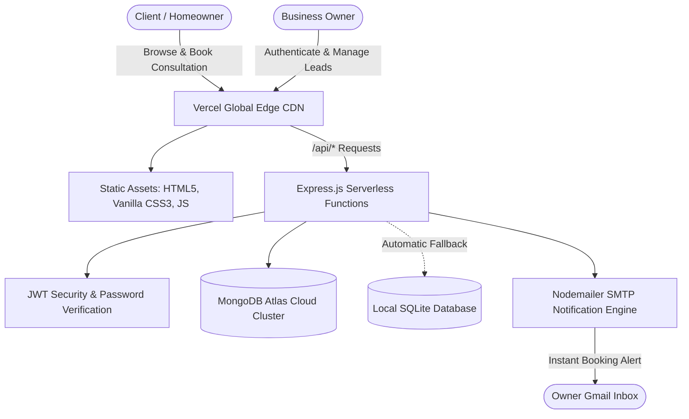

# 🛁 Brick & Bath — Luxury Bathroom Renovation Platform

<div align="center">


### **BATHROOM MEETS LIFESTYLE**
*Powered by Bricknbar*

A full-stack, enterprise-grade digital showroom and turnkey management platform engineered for Odisha's premier luxury bathroom design and renovation firm.

---

[](https://nodejs.org/)
[](https://expressjs.com/)
[](https://www.mongodb.com/atlas)
[](https://www.sqlite.org/)
[](https://vercel.com/)
[](https://jwt.io/)

[Explore Website](#-features-at-a-glance) • [Owner Portal](#-executive-owner-portal) • [API Documentation](#-rest-api-documentation) • [Deployment Guide](#-deployment-to-vercel)

---

</div>

## 🌟 Overview

**Brick & Bath** transforms traditional bathroom remodeling into an end-to-end luxury architectural experience. This repository contains the complete full-stack web application, featuring an ultra-responsive client showroom, an interactive turnkey package estimator, an executive password-authenticated Owner Portal, and a dual-engine database architecture (MongoDB Atlas + SQLite fallback).

---

## ✨ Features at a Glance

### 💎 Client-Facing Digital Showroom (`index.html`)
* **Bespoke Luxury Aesthetics:** Tailored dark-mode architectural styling (`#0B111A`) paired with brushed champagne gold accents (`#C59D42`) and Cinzel/Outfit typography.
* **Before & After Transformation Slider:** Interactive split-screen slider demonstrating actual bathroom transformations before and after turnkey execution.
* **Interactive Turnkey Package & Cost Estimator:** Real-time pricing calculator allowing customers to select room types (*Master, Guest, Powder*), scope (*Full Turnkey, Wet Area, Cosmetic*), and collections (*Standard, Prestige, Elite, Signature*) with automatic quotation estimates.
* **Digital Lookbook & Flipbook Catalogue:** Embedded interactive catalogue viewer for 2026 collection finishes, Italian tiles, and concealed sanitaryware.
* **Smart Consultation Booking:** Multi-step consultation scheduler that automatically syncs requirements and preferred dates with the backend.
* **Interactive Materials & Moodboard Customizer:** Live palette switcher allowing clients to preview marble textures, sanitary finishes, and designer lighting schemes.
* **One-Click WhatsApp Concierge:** Instant pre-formatted chat integration connected directly with senior architectural engineers.

---

### 🔐 Executive Owner Portal (`owner-login.html` & `inquiries.html`)
* **Cryptographically Signed JWT Authentication:** Access is strictly guarded by username and password (`admin` / `rudra1234`) with 24-hour expiration tokens.
* **Real-Time Consultation Ledger:** Clean, searchable database ledger showing all leads submitted through the website.
* **5-Stage Lifecycle Status Manager:** Easily track and update client journeys directly from an interactive dropdown:
  * 🟡 **`New`** — Recently submitted consultation lead.
  * 🔵 **`Contacted`** — Initial client call/chat completed.
  * 🟣 **`Assessment Scheduled`** — In-home 3D laser measurement booked.
  * 🟠 **`Quotation Sent`** — 3D blueprint & itemized cost proposal shared.
  * 🟢 **`Converted`** — Turnkey contract signed and renovation in progress.
* **Internal Architectural Notes:** Add private remarks, inspection times, or material specifications to any lead.
* **One-Click Quick Actions:** Direct click-to-call and pre-filled WhatsApp response buttons for instant customer follow-up.
* **Excel / CSV Export:** Download the entire inquiries database with a single click.

---

## 🏛️ System Architecture



---

## 🗄️ Dual-Engine Database Reliability

To guarantee **zero lead loss**, the backend implements a resilient dual-storage pattern:

| Engine | Role | Location | Description |
| :--- | :--- | :--- | :--- |
| **MongoDB Atlas** | Primary Cloud Database | Cloud Cluster | Multi-region replica set storing consultation documents, status timestamps, and notes. |
| **SQLite** | Local Fail-Safe Fallback | `backend/data/bricknbath.sqlite` | Automatic zero-configuration embedded database active if cloud connectivity is interrupted. |

---

## 📡 REST API Documentation

### 📋 Inquiries & Consultations (`/api/inquiries`)

| Method | Endpoint | Access | Description |
| :--- | :--- | :--- | :--- |
| `POST` | `/api/inquiries` | Public | Submit a new consultation booking from the website. |
| `GET` | `/api/inquiries` | 🔒 Owner | Fetch all consultation records with optional search filter. |
| `GET` | `/api/inquiries/:refId` | Public | Retrieve inquiry details by Reference ID or phone number. |
| `PATCH` | `/api/inquiries/:id` | 🔒 Owner | Update consultation status (`New` ➔ `Converted`) or internal notes. |
| `DELETE` | `/api/inquiries/:id` | 🔒 Owner | Delete or archive an inquiry. |
| `GET` | `/api/inquiries/stats` | 🔒 Owner | Retrieve real-time dashboard metrics and conversion rates. |
| `GET` | `/api/inquiries/export/csv` | 🔒 Owner | Stream all inquiries as a downloadable `.csv` file. |

### 🔑 Authentication (`/api/auth`)

| Method | Endpoint | Access | Description |
| :--- | :--- | :--- | :--- |
| `POST` | `/api/auth/login` | Public | Verify owner credentials (`admin` / `rudra1234`) & issue signed JWT. |
| `GET` | `/api/auth/verify` | 🔒 Owner | Verify session validity and token expiration. |

### 💼 Careers (`/api/careers`)

| Method | Endpoint | Access | Description |
| :--- | :--- | :--- | :--- |
| `POST` | `/api/careers` | Public | Submit career application (architects, site supervisors, interior designers). |
| `GET` | `/api/careers` | 🔒 Owner | View submitted talent applications. |

---

## ⚙️ Environment Variables Reference

Create a `.env` file in the root directory (based on `.env.example`):

```ini
# Server Configuration
PORT=5000
NODE_ENV=production

# MongoDB Atlas Cloud Database
MONGODB_URI=mongodb+srv://<username>:<password>@cluster.mongodb.net/bricknbath?retryWrites=true&w=majority

# Local SQLite Fallback File
DB_PATH=./backend/data/bricknbath.sqlite

# Owner Authentication Credentials
OWNER_USERNAME=admin
OWNER_PASSWORD=rudra1234
JWT_SECRET=bnb_luxury_jwt_secret_super_secure_key_2026
JWT_EXPIRY=24h

# Email Notification Service (Gmail SMTP)
OWNER_EMAIL=contact@bricknbath.com
SMTP_HOST=smtp.gmail.com
SMTP_PORT=465
SMTP_SECURE=true
SMTP_USER=your_email@gmail.com
SMTP_PASS=your_16_digit_google_app_password
```

---

## 🚀 Local Development Setup

### 1. Clone the Repository
```bash
git clone https://github.com/bijayalaxmilenka2002/Brick-Bath.git
cd Brick-Bath
```

### 2. Install Dependencies
```bash
npm install
```

### 3. Start Local Development Server
```bash
npm start
```
* **Customer Website:** `http://localhost:5000`
* **Owner Portal Login:** `http://localhost:5000/owner-login.html`
* **Health Check:** `http://localhost:5000/api/health`

---

## ☁️ Deployment to Vercel

This repository is pre-configured with **`vercel.json`** and **`api/index.js`** for instant serverless deployment:

1. Push your repository to GitHub.
2. Log in to [Vercel](https://vercel.com) and click **"Add New Project"** ➔ **Import `Brick-Bath`**.
3. Under **Environment Variables**, add:
   * `MONGODB_URI`
   * `OWNER_USERNAME`
   * `OWNER_PASSWORD`
   * `JWT_SECRET`
   * `OWNER_EMAIL`
4. Click **Deploy**. Your application will be live across Vercel's global CDN in under 60 seconds!

---

## 📱 Contact & Experience Center

* **Location:** Jayadev Vihar, Bhubaneswar, Odisha — 751013
* **Helpline:** +91 72058 89111
* **Toll Free:** 1800-212-0151
* **Email:** [contact@bricknbath.com](mailto:contact@bricknbath.com)
* **Website:** [www.bricknbath.com](https://www.bricknbath.com/)

---

<div align="center">
  <sub>© 2026 Brick & Bath (Powered by Bricknbar). All Rights Reserved. Crafted for Architectural Excellence.</sub>
</div>
