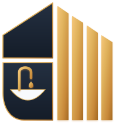
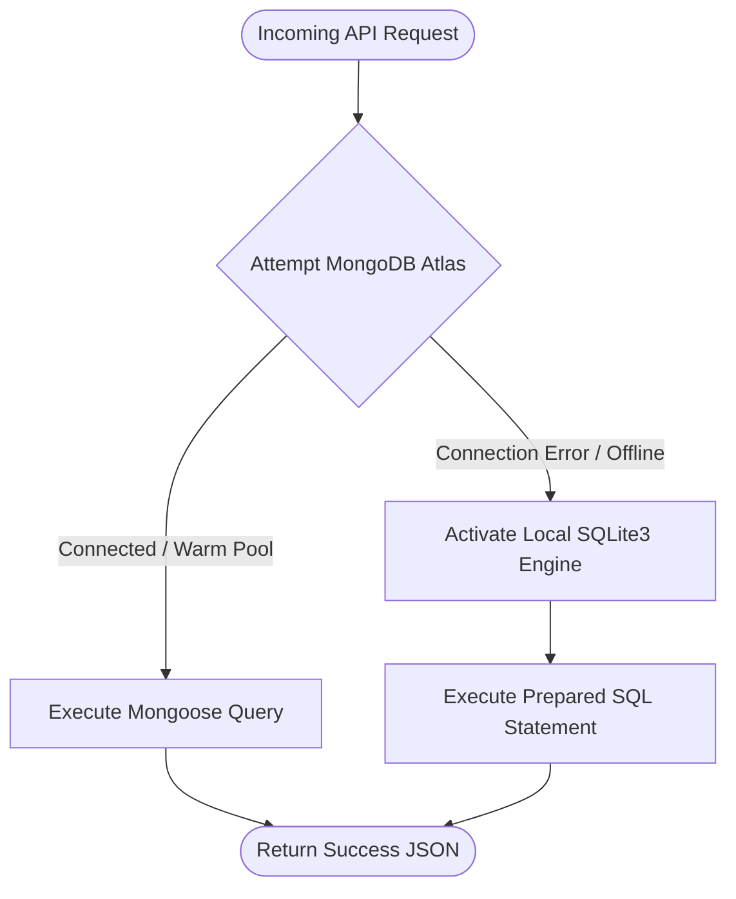
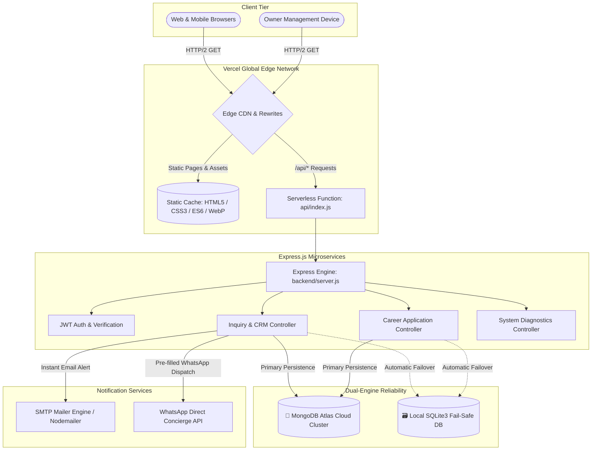

# 🛁 Brick & Bath — Luxury Bathroom Renovation Platform

<div align="center">



# **BRICK & BATH**
### ✨ *BATHROOM MEETS LIFESTYLE* ✨
*Powered by Bricknbar • Odisha's Premier Turnkey Bathroom Renovation Platform*

<p align="center">
  <a href="https://brick-bath.vercel.app" target="_blank">
    
  </a>
  <a href="https://brick-bath.vercel.app/owner-login.html" target="_blank">
    
  </a>
  <a href="https://brick-bath.vercel.app/careers.html" target="_blank">
    
  </a>
  <a href="https://brick-bath.vercel.app/api/health" target="_blank">
    
  </a>
</p>

[](https://brick-bath.vercel.app)
[](https://nodejs.org/)
[](https://expressjs.com/)
[](https://www.mongodb.com/atlas)
[](https://www.sqlite.org/)
[](https://jwt.io/)
[](https://brick-bath.vercel.app/#process)
[](https://brick-bath.vercel.app/#faq)

<br/>

<a href="https://brick-bath.vercel.app" target="_blank">
  
</a>

<br/><br/>

### 📍 [Explore Live Website](https://brick-bath.vercel.app) • 🔐 [Owner Portal](https://brick-bath.vercel.app/owner-login.html) • 💼 [Careers Portal](https://brick-bath.vercel.app/careers.html) • 📋 [Inquiries CRM](https://brick-bath.vercel.app/inquiries.html) • 📡 [API Endpoints](#-rest-api-documentation) • 🚀 [Quickstart](#-local-development-setup)

---

</div>

## 📑 Table of Contents

- [🌟 Live Deployments & Portals](#-live-deployments--portals)
- [📖 Executive Overview](#-executive-overview)
- [🛠️ Complete Technology Stack & Architectural Decisions](#️-complete-technology-stack--architectural-decisions)
  - [1. Frontend Layer (Digital Showroom & Portals)](#1-frontend-layer-digital-showroom--portals)
  - [2. Styling & Design System](#2-styling--design-system)
  - [3. Interactive Frontend Engines & Algorithms](#3-interactive-frontend-engines--algorithms)
  - [4. Backend Architecture & Microservices](#4-backend-architecture--microservices)
  - [5. Database Layer: Dual-Engine Resilient Topology](#5-database-layer-dual-engine-resilient-topology)
  - [6. Authentication, Authorization & Security](#6-authentication-authorization--security)
  - [7. Notification Services & Communications](#7-notification-services--communications)
  - [8. Infrastructure, Serverless Hosting & DevOps](#8-infrastructure-serverless-hosting--devops)
- [🏛️ High-Level System Architecture Diagram](#️-high-level-system-architecture-diagram)
- [📁 Annotated Project Directory Structure](#-annotated-project-directory-structure)
- [🔄 Core Data Flows & Request Lifecycles](#-core-data-flows--request-lifecycles)
- [💎 Feature Breakdown by Portal](#-feature-breakdown-by-portal)
- [📡 Comprehensive REST API Documentation](#-comprehensive-rest-api-documentation)
- [🔐 Demo Owner Credentials](#-demo-owner-credentials)
- [⚙️ Environment Variables Reference](#️-environment-variables-reference)
- [🚀 Local Development Setup](#-local-development-setup)
- [☁️ Production Deployment on Vercel](#️-production-deployment-on-vercel)
- [📱 Experience Center & Brand Contact](#-experience-center--brand-contact)
- [👩‍💻 Author](#-author)

---

## 🌟 Live Deployments & Portals

The application runs live with high availability on **Vercel's Global Edge Network** connected with **MongoDB Atlas Cloud Database**:

| Portal / Resource | Live URL | Access Level | Description |
| :--- | :--- | :--- | :--- |
| **🌐 Client Digital Showroom** | [https://brick-bath.vercel.app](https://brick-bath.vercel.app) | Public | Customer-facing luxury showroom, enlarged interactive showcase slider, turnkey estimator, 3D gallery, lookbook & consultation booking. |
| **💼 Dedicated Careers Portal** | [https://brick-bath.vercel.app/careers.html](https://brick-bath.vercel.app/careers.html) | Public | Standalone talent acquisition portal with role filtering, job specifications, pre-populated application modal & `/api/careers` persistence. |
| **🔐 Owner Portal Gateway** | [https://brick-bath.vercel.app/owner-login.html](https://brick-bath.vercel.app/owner-login.html) | Owner Auth | Cryptographically signed JWT login gateway for business owners and site supervisors. |
| **📊 Lead Management CRM Desk** | [https://brick-bath.vercel.app/inquiries.html](https://brick-bath.vercel.app/inquiries.html) | 🔒 Protected | Real-time consultation ledger with 5-stage lifecycle pipeline, manual in-person client registration modal, notes, WhatsApp triggers & CSV export. |
| **🩺 Backend API Diagnostics** | [https://brick-bath.vercel.app/api/health](https://brick-bath.vercel.app/api/health) | Public | Real-time health endpoint reporting MongoDB Atlas connection state, version, and serverless uptime. |
| **🌍 Official Domain Alias** | [https://www.bricknbath.com](https://www.bricknbath.com) | Canonical | Production domain with SSL & dynamic SEO XML sitemaps. |

---

## 📖 Executive Overview

**Brick & Bath** (powered by *Bricknbar*) is an enterprise-grade full-stack platform built for luxury interior architecture and turnkey bathroom renovation across Odisha (Bhubaneswar, Cuttack, Puri).

Traditional home renovations suffer from contractor opacity, delayed timelines, uncertain material costs, and recurring waterproofing leaks. **Brick & Bath** solves these pain points through:
1. **Interactive 3D Visualizer & Dynamic Cost Estimator:** Homeowners configure scope, layout, and finish tiers for instant, transparent pricing.
2. **21-Day Guaranteed Turnaround:** Rigorous 5-step engineering blueprint with scheduled milestone handovers and 5-to-10 year waterproofing warranties.
3. **Dedicated Executive CRM & Lead Pipeline:** 5-stage customer lifecycle desk with manual walk-in capture, architect notes, WhatsApp triggers, and CSV data export.
4. **Resilient Dual-Database Architecture:** Enterprise connection pooling on **MongoDB Atlas** with automated local **SQLite fallback** to guarantee zero data loss.

---

## 🛠️ Complete Technology Stack & Architectural Decisions

This section provides software developers with a clear, definitive reference of **what technology is used, where it is used, and why it was chosen**.

```
┌──────────────────────────────────────────────────────────────────────────────────────────────────┐
│                                    FULL TECHNOLOGY STACK MATRIX                                   │
├──────────────────────┬───────────────────────────────┬───────────────────────────────────────────┤
│ Layer                │ Technologies Used             │ Where Used & Architectural Purpose        │
├──────────────────────┼───────────────────────────────┼───────────────────────────────────────────┤
│ Frontend Core        │ HTML5, Vanilla JavaScript ES6 │ index.html, careers.html, inquiries.html  │
│                      │                               │ Zero-dependency, blazing-fast initial     │
│                      │                               │ load, pure DOM lifecycle control.         │
├──────────────────────┼───────────────────────────────┼───────────────────────────────────────────┤
│ Styling & Theming    │ Vanilla CSS3, CSS Variables   │ css/luxury-theme.css, components.css,     │
│                      │ Glassmorphism, Micro-anims    │ responsive.css. Obsidian dark palette &   │
│                      │                               │ champagne gold design tokens.             │
├──────────────────────┼───────────────────────────────┼───────────────────────────────────────────┤
│ Interactive Engines  │ Custom JS State Machines      │ js/app.js (Hero slider, modals, lookbook) │
│                      │ Draggable Pointer APIs        │ js/estimator.js (Dynamic cost calculator) │
│                      │ Touch / Swipe gestures        │ js/data.js (Static configuration store)   │
├──────────────────────┼───────────────────────────────┼───────────────────────────────────────────┤
│ Backend Runtime      │ Node.js (v18 / v22 LTS)       │ backend/server.js, api/index.js           │
│                      │ Express.js (v4.21.2)          │ Lightweight REST API pipeline & routing.  │
├──────────────────────┼───────────────────────────────┼───────────────────────────────────────────┤
│ Primary Database     │ MongoDB Atlas (Cloud Cluster) │ backend/config/db.js, models/*.js         │
│                      │ Mongoose ODM (v9.10.2)        │ Primary persistence for inquiries & jobs. │
├──────────────────────┼───────────────────────────────┼───────────────────────────────────────────┤
│ Fail-Safe Database   │ SQLite3 (v5.1.7)              │ backend/config/db.js, data/*.sqlite       │
│                      │ Local Embedded SQL            │ Automatic offline fallback when cloud     │
│                      │                               │ connection is temporarily unreachable.    │
├──────────────────────┼───────────────────────────────┼───────────────────────────────────────────┤
│ Authentication       │ JSON Web Tokens (jsonwebtoken)│ backend/middleware/authMiddleware.js      │
│                      │ bcryptjs (v3.0.3)             │ Stateless Bearer token verification &     │
│                      │                               │ salted password validation for owner CRM. │
├──────────────────────┼───────────────────────────────┼───────────────────────────────────────────┤
│ Notifications        │ Nodemailer (v10.0.10)         │ backend/services/emailService.js          │
│                      │ WhatsApp Click-to-Chat API    │ Automated HTML email alerts to owner desk │
│                      │                               │ & one-click client WhatsApp dispatch.     │
├──────────────────────┼───────────────────────────────┼───────────────────────────────────────────┤
│ Hosting & Edge       │ Vercel Serverless Functions   │ api/index.js, vercel.json                 │
│                      │ Vercel Global Edge CDN        │ Global edge asset distribution & zero-    │
│                      │                               │ maintenance serverless API execution.     │
├──────────────────────┼───────────────────────────────┼───────────────────────────────────────────┤
│ Assets & Typography  │ Google Fonts, Cloudinary CDN  │ Bodoni Moda, Cinzel, Outfit typography;   │
│                      │ WebP with PNG fallbacks       │ High-resolution architectural photography │
└──────────────────────┴───────────────────────────────┴───────────────────────────────────────────┘
```

---

### 1. Frontend Layer (Digital Showroom & Portals)

* **Semantic HTML5:**
  * **Where:** `index.html` (Client Showroom), `careers.html` (Careers Portal), `owner-login.html` (Admin Gateway), `inquiries.html` (Lead CRM Desk).
  * **Why:** Provides structural semantics (`<header>`, `<nav>`, `<main>`, `<section>`, `<article>`, `<aside>`, `<footer>`), optimal accessibility (ARIA roles, live regions), and rich SEO metadata (Schema.org JSON-LD, OpenGraph, Twitter Cards).
* **Vanilla JavaScript (ES6+):**
  * **Where:** `js/app.js`, `js/data.js`, `js/estimator.js`, inline modular scripts on portals.
  * **Why:** Avoids heavy single-page application (SPA) runtime overhead (React/Vue/Angular bundle penalties). Delivers near-instant First Contentful Paint (FCP < 0.6s) and zero hydration delay while giving developers raw, predictable DOM manipulation.

---

### 2. Styling & Design System

* **Architecture:** Modular separation into three distinct stylesheets:
  * **`css/luxury-theme.css`:** Core design tokens, CSS custom properties (`--bg-darkest: #070A0F`, `--bg-dark: #0B111A`, `--gold-primary: #C59D42`), typography definitions, layout resets, and container boundaries (`.container`, `.container-wide`).
  * **`css/components.css`:** Reusable UI components including buttons (`.btn-gold`, `.btn-outline-gold`), badges, modal overlays, frosted glass panels (`backdrop-filter: blur(16px)`), hero showcase cards, and form controls.
  * **`css/responsive.css`:** Dedicated media query breakpoints (1440px, 1280px, 1024px, 768px, 540px, 380px) ensuring fluid scalability from 4K monitors down to mobile handsets.
* **Aesthetic Identity:**
  * **Obsidian Canvas:** Deep midnight tones (`#070A0F`, `#0B111A`, `#101725`) to evoke high-end luxury interiors.
  * **Champagne Gold Accents:** Linear gradients (`#F5D794` ➔ `#C59D42` ➔ `#9E7427`) for CTAs, active states, and borders.
  * **Luxury Editorial Typography:** Headings rendered in **Bodoni Moda** and **Cinzel**; UI labels, data, and body copy rendered in **Outfit** and **Plus Jakarta Sans**.

---

### 3. Interactive Frontend Engines & Algorithms

#### A. Hero Architectural Showcase Slider (`js/app.js`)
* **Visualized Components:**
  * **Enlarged Viewport:** Expanded 600px height stage within a widescreen 1.25fr grid column, framed with champagne gold edge glows (`rgba(197, 157, 66, 0.35)`).
  * **Active Countdown Progress Bar:** A linear gradient bar (`#hero-progress-bar`) that smoothly fills from `0%` to `100%` across the 4.5-second slide duration (`slideDuration = 4500ms`).
  * **Slide Information Overlay:** Frosted glass caption card (`.hero-slide-caption`) presenting the collection badge (e.g. `★ Most Popular`), guaranteed handover timeline (`21–25 Days`), description, specifications chips, and an explore CTA.
  * **Play / Pause Autoplay Controller:** Dedicated button (`#hero-autoplay-toggle`) enabling users to toggle automatic cycling, with live text state (`Auto` vs `Paused`).
  * **Micro-Interactions:** Pauses automatically on `mouseenter` or mobile touch so users can inspect bathroom details; resumes cleanly on `mouseleave`.
  * **Asset Preloading:** Immediately loads all 4 high-resolution bathroom WebP designs into browser memory using `new Image()` to eliminate slide transition flicker.

#### B. Turnkey Cost Estimator Engine (`js/estimator.js`)
* **State Machine Calculation:**
  $$\text{Estimated Cost} = (\text{Base Package Rate} \times \text{Bathroom Type Multiplier}) + \text{Scope Add-ons} \pm \text{Square Footage Adjustment}$$
* Real-time recalculation as the user steps through:
  1. **Bathroom Type:** Master Ensuite, Family Bathroom, Powder Room.
  2. **Scope of Work:** Turnkey Gut Renovation, Wet-Area Upgrade, Aesthetic Refresh.
  3. **Collection Tier:** Aura (Vitrified/Jaquar), Prestige (Fluted/Kohler), Elite (Spa/Grohe), Signature (Calacatta/TOTO).
  4. **Output:** Instant calculated quote with itemized material breakdown, timeline guarantee, and one-click submission to the consultation desk.

#### C. Interactive Before & After Split Slider (`js/app.js`)
* Draggable comparison element comparing real renovation transformations.
* Uses pointer coordinates (`clientX` / `touches`) to adjust the CSS `clip-path` / width of the `afterWrapper` in real time with hardware-accelerated transforms.

---

### 4. Backend Architecture & Microservices

* **Runtime:** **Node.js** (v18 / v22 LTS).
* **Web Framework:** **Express.js (v4.21.2)**.
* **Serverless Entrypoint (`api/index.js`):** Adapts the Express application into a serverless handler on Vercel without altering route definitions.
* **Modular MVC Structure:**
  * **`backend/routes/`:** Decoupled REST routes (`inquiryRoutes.js`, `careerRoutes.js`, `authRoutes.js`, `healthRoutes.js`).
  * **`backend/controllers/`:** Business logic handling data validation, database persistence, error catching, and email dispatch (`inquiryController.js`, `careerController.js`, `authController.js`).
  * **`backend/models/`:** Mongoose schemas defining strict data contracts (`Inquiry.js`, `Career.js`).
  * **`backend/middleware/`:** Custom middleware for JWT authentication (`authMiddleware.js`).
  * **`backend/services/`:** Notification integration utilities (`emailService.js`).

---

### 5. Database Layer: Dual-Engine Resilient Topology

To guarantee **zero lead loss** even during external cloud outages, the backend implements an automatic dual-database failover pattern in `backend/config/db.js`:



* **Primary Engine — MongoDB Atlas Cloud Cluster:**
  * Connects via `mongoose.connect()` using environment connection pooling (`serverSelectionTimeoutMS: 8000`).
  * Caches connection promises across serverless warm invocations (`cachedMongoConn`) to eliminate repetitive TCP handshakes.
  * Stores:
    * `Inquiries`: Customer name, email, phone, city, bathroom type, selected package, budget, appointment date, lifecycle status (`New`, `Contacted`, `Assessment Scheduled`, `Quotation Sent`, `Converted`), internal architect notes, and timestamps.
    * `Careers`: Candidate name, contact details, target position, experience, portfolio links, and application notes.
* **Fail-Safe Fallback — Embedded SQLite3:**
  * Initialized via `sqlite3.verbose()`. Automatically creates tables (`inquiries`, `careers`) if not present.
  * Seamlessly processes writes if MongoDB Atlas is unreachable during development or localized outages.

---

### 6. Authentication, Authorization & Security

* **Cryptographic Token Verification:**
  * **Library:** `jsonwebtoken` (v9.0.3).
  * On `/api/auth/login`, credentials (`OWNER_USERNAME`, `OWNER_PASSWORD`) are verified. Upon success, a signed JWT bearer token is issued with a 24-hour expiration (`JWT_EXPIRY=24h`).
* **Protected Routes:**
  * The `verifyToken` middleware validates `Authorization: Bearer <TOKEN>` on all sensitive CRM endpoints (`GET /api/inquiries`, `PATCH /api/inquiries/:id`, `DELETE /api/inquiries/:id`, `GET /api/inquiries/export/csv`, `GET /api/careers`).
* **Credential Protection:**
  * Passwords hashed using `bcryptjs` (v3.0.3).
  * CORS headers configured via `cors` (v2.8.5) restricting unauthorized cross-origin requests.

---

### 7. Notification Services & Communications

* **Automated SMTP Email Alerts (`backend/services/emailService.js`):**
  * Powered by **Nodemailer (v10.0.10)** connecting via SSL/TLS to Gmail SMTP (`smtp.gmail.com:465`).
  * When a customer submits an inquiry, an email formatted with luxury HTML styling is dispatched to the owner desk within milliseconds, detailing client requirements, budget range, and selected bathroom package.
* **Direct WhatsApp Concierge Integration:**
  * Generates pre-formatted URI-encoded WhatsApp links (`https://wa.me/917205889111?text=...`) containing the unique client reference code (`#BNB-2026-XXXX`).
  * Enables owners and site supervisors to trigger one-tap mobile follow-ups directly from the CRM desk.

---

### 8. Infrastructure, Serverless Hosting & DevOps

* **Vercel Global Edge Network:**
  * Static assets (`index.html`, `careers.html`, `inquiries.html`, `css/`, `assets/`, `js/`) are served directly from global edge caches with HTTP/2 and Brotli compression.
  * API requests (`/api/*`) are dynamically routed to `api/index.js` via `vercel.json` rewrites:
    ```json
    {
      "version": 2,
      "rewrites": [
        { "source": "/api/(.*)", "destination": "/api/index.js" }
      ]
    }
    ```
* **Continuous Integration & Deployment (CI/CD):**
  * Automated deployments trigger on every `git push` to `origin/main`.
  * Production builds require zero external compilation step (`npm run build` not needed for static HTML/JS), ensuring fast deploy times.

---

## 🏛️ High-Level System Architecture Diagram



---

## 📁 Annotated Project Directory Structure

```text
Barthroom_Decor_Website/
├── .env                              # Local environment secrets (Git ignored)
├── .env.example                      # Template for environment configuration
├── .gitignore                        # Git exclusion rules
├── README.md                         # Comprehensive software engineering documentation
├── package.json                      # Project manifest, dependencies, and scripts
├── package-lock.json                 # Pinned dependency tree
├── vercel.json                       # Vercel serverless routing configuration
├── sitemap.xml                       # Search Engine Optimization URL registry
├── robots.txt                        # Web crawler indexing directives
│
├── index.html                        # Main client digital showroom & turnkey estimator
├── careers.html                      # Standalone careers & talent application portal
├── owner-login.html                  # Executive authentication portal gateway
├── inquiries.html                    # Real-time consultation CRM & lead pipeline desk
│
├── api/
│   └── index.js                      # Vercel serverless handler adapter for Express
│
├── backend/
│   ├── server.js                     # Express application configuration & route binding
│   ├── test-db-connection.js         # Standalone diagnostic test script for MongoDB Atlas
│   ├── config/
│   │   └── db.js                     # Dual-engine connection manager (MongoDB Atlas + SQLite)
│   ├── controllers/
│   │   ├── authController.js         # JWT generation, credential checks & verification
│   │   ├── inquiryController.js      # Lead lifecycle CRUD, search, stats & CSV export
│   │   └── careerController.js       # Job application submission & viewing
│   ├── middleware/
│   │   └── authMiddleware.js         # JWT Bearer token extraction & cryptographic validation
│   ├── models/
│   │   ├── Inquiry.js                # Mongoose schema for consultations & lead states
│   │   └── Career.js                 # Mongoose schema for talent applications
│   ├── routes/
│   │   ├── authRoutes.js             # Authentication REST endpoints (/api/auth)
│   │   ├── inquiryRoutes.js          # Inquiry & CRM REST endpoints (/api/inquiries)
│   │   ├── careerRoutes.js           # Career application REST endpoints (/api/careers)
│   │   └── healthRoutes.js           # Service diagnostic endpoint (/api/health)
│   ├── services/
│   │   └── emailService.js           # Nodemailer SMTP transport & luxury HTML mail templates
│   └── data/
│       └── bricknbath.sqlite         # Local embedded SQLite fail-safe database file
│
├── css/
│   ├── luxury-theme.css              # Obsidian & gold design tokens, resets, typography
│   ├── components.css                # Reusable UI elements, modals, cards, sliders, buttons
│   └── responsive.css                # Fluid media queries for 4K down to mobile displays
│
├── js/
│   ├── app.js                        # Main application logic: hero slideshow, modals, booking
│   ├── data.js                       # Static store: collections, catalog, pricing, reviews
│   └── estimator.js                  # Dynamic turnkey cost estimator calculation engine
│
└── assets/
    ├── brand_emblem.svg              # Official vector brand logo
    ├── LoginBg.6cc88ac4ffa684683414.jpg # Luxury background canvas photography
    ├── navlogo.3c15008711dbb09cbf59.png # Favicon and browser badge
    ├── services/                     # High-res bathroom photography (WebP + PNG)
    │   ├── aura.webp / aura.png
    │   ├── prestige.webp / prestige.png
    │   ├── elite.webp / elite.png
    │   └── signature.webp / signature.png
    └── transforms/                   # Before and after renovation comparison photography
        ├── transform1_before.png / transform1_after.png
        └── transform2_before.png / transform2_after.png
```

---

## 🔄 Core Data Flows & Request Lifecycles

### 1. Client Consultation Submission Flow

```text
[Homeowner on index.html]
       │
       ▼ (Fills Consultation Form / Estimator)
[Client-Side Validation in js/app.js]
       │
       ▼ (POST /api/inquiries with JSON payload)
[Vercel Edge CDN Router ➔ api/index.js ➔ backend/server.js]
       │
       ▼
[inquiryController.createInquiry()]
       ├── Generates Unique Ref ID (e.g. #BNB-2026-8472)
       ├── Sets Initial Lifecycle Status = 'New'
       ├── Persists Document to MongoDB Atlas Cluster
       │     └─ (Auto-fallback to SQLite if offline)
       └── Triggers Asynchronous Notifications:
             ├── emailService.sendInquiryNotification() ➔ SMTP ➔ Business Owner
             └── Returns 201 Created JSON to Client
       │
       ▼
[Client UI displays Confirmation Modal + Direct WhatsApp Concierge Button]
```

### 2. Owner Authentication & CRM Pipeline Operations

```text
[Executive on owner-login.html]
       │
       ▼ (Submits admin username & password)
[POST /api/auth/login]
       │
       ▼
[authController.login()]
       ├── Verifies credentials against salted hash / environment secrets
       ├── Signs JWT Token with 24-Hour Expiration (HMAC-SHA256)
       └── Returns { success: true, token, user }
       │
       ▼
[Token stored in browser localStorage]
       │
       ▼ (Navigates to inquiries.html)
[GET /api/inquiries with Header: Authorization: Bearer <TOKEN>]
       │
       ▼
[authMiddleware.verifyToken()]
       ├── Verifies cryptographic signature & expiration
       └── Passes execution to inquiryController.getAllInquiries()
       │
       ▼
[CRM Renders 5-Stage Visual Kanban Table with Status Transitions & Architect Notes]
```

---

## 💎 Feature Breakdown by Portal

### 🎨 Client Digital Showroom (`index.html`)
* **Architectural Showcase Slider:** Enlarged 600px viewport, visual countdown progress bar, interactive collection specs, play/pause controls, and touch swipe.
* **Before & After Interactive Split Slider:** Real transformations from Bhubaneswar homes.
* **Dynamic Turnkey Cost Estimator:** Real-time quote calculations across 4 tiers.
* **Digital Flipbook Catalogue:** Full-screen interactive collection catalog.
* **Live Material & Tile Switcher:** Instant swatch preview of Italian Calacatta, Nero Marquina, and brushed hardware.

### 💼 Dedicated Careers Portal (`careers.html`)
* **Role Category Filtering:** Filter tabs for *Site Operations*, *Design & 3D*, *Client Relations*, and *Artisans & Trades*.
* **Detailed Job Specifications:** Requirements, compensation packages, and site responsibilities for Project Managers, Site Supervisors, 3D Visualizers, etc.
* **Integrated Application Modal:** Pre-populates the chosen job title and submits directly to `/api/careers`.
* **HR Direct Line:** Direct link to chat with the Brick & Bath talent desk on WhatsApp.

### 🔐 Executive Owner Portal & CRM (`owner-login.html` & `inquiries.html`)
* **JWT-Protected Security Layer:** 24-hour cryptographically signed tokens.
* **5-Stage Lead Lifecycle Management:** `New` ➔ `Contacted` ➔ `Assessment Scheduled` ➔ `Quotation Sent` ➔ `Converted`.
* **Manual Walk-In Client Registration Modal:** Form enabling owners to manually capture showroom walk-in visitors and phone inquiries.
* **Internal Architect Notes:** Add private remarks, site dimensions, and plumbing notes per client file.
* **CSV Data Export:** One-click download of all consultation records for offline reporting.

---

## 📡 Comprehensive REST API Documentation

### 📋 Inquiries & Consultation CRM (`/api/inquiries`)

| Method | Endpoint | Access Level | Description |
| :--- | :--- | :--- | :--- |
| `POST` | `/api/inquiries` | Public | Submit new consultation lead with package details, date & phone. |
| `GET` | `/api/inquiries` | 🔒 Owner | Retrieve all consultation leads with optional keyword and status search. |
| `GET` | `/api/inquiries/:refId` | Public | Lookup inquiry information by Reference ID (e.g., `#BNB-2026-XXXX`). |
| `PATCH` | `/api/inquiries/:id` | 🔒 Owner | Update status (`New` ➔ `Contacted` ➔ `Converted`) or add internal notes. |
| `DELETE` | `/api/inquiries/:id` | 🔒 Owner | Permanently remove or archive a consultation document. |
| `GET` | `/api/inquiries/stats` | 🔒 Owner | Retrieve real-time metrics, active leads, and conversion ratios. |
| `GET` | `/api/inquiries/export/csv` | 🔒 Owner | Download consultation records as a structured `.csv` spreadsheet. |

#### Sample Consultation Payload (`POST /api/inquiries`)
```json
{
  "name": "Arun Patnaik",
  "email": "arun.patnaik@example.com",
  "phone": "9876543210",
  "city": "Bhubaneswar",
  "bathroomType": "Master Ensuite",
  "collection": "Prestige Elegance (Brushed Gold / Kohler)",
  "budget": "₹3.5L – ₹6.5L (Turnkey Prestige)",
  "preferredDate": "2026-10-05",
  "notes": "Looking for fluted vanity and anti-fog LED mirror."
}
```

---

### 🔑 Authentication (`/api/auth`)

| Method | Endpoint | Access Level | Description |
| :--- | :--- | :--- | :--- |
| `POST` | `/api/auth/login` | Public | Verify credentials and receive a signed JWT bearer token. |
| `GET` | `/api/auth/verify` | 🔒 Owner | Verify active JWT token validity and session status. |

---

### 💼 Careers (`/api/careers`)

| Method | Endpoint | Access Level | Description |
| :--- | :--- | :--- | :--- |
| `POST` | `/api/careers` | Public | Submit job application for site engineers, 3D visualizers, or managers. |
| `GET` | `/api/careers` | 🔒 Owner | View submitted talent applications and portfolio links. |

---

### 🩺 System Diagnostics (`/api/health`)

| Method | Endpoint | Access Level | Description |
| :--- | :--- | :--- | :--- |
| `GET` | `/api/health` | Public | View live status of backend services and MongoDB Atlas connection. |

---

## 🔐 Demo Owner Credentials

To inspect the **Executive Owner Portal & Lead CRM** on the live deployment:

* **Portal Gateway:** [https://brick-bath.vercel.app/owner-login.html](https://brick-bath.vercel.app/owner-login.html)
* **Username:** `admin`
* **Password:** `rudra1234`

> [!NOTE]  
> Upon successful authentication, the signed JWT is saved to `localStorage` and automatically appended to the `Authorization: Bearer <TOKEN>` header on all CRM calls.

---

## ⚙️ Environment Variables Reference

Create a `.env` file in the project root based on `.env.example`:

```ini
# Application Server Port & Environment
PORT=5000
NODE_ENV=production

# Primary Database: MongoDB Atlas Cloud Cluster URI
MONGODB_URI=mongodb+srv://<username>:<password>@cluster.mongodb.net/bricknbath?retryWrites=true&w=majority

# Fail-Safe Database: Local SQLite File Path
DB_PATH=./backend/data/bricknbath.sqlite

# Executive Owner Credentials & JWT Secrets
OWNER_USERNAME=admin
OWNER_PASSWORD=rudra1234
JWT_SECRET=bnb_luxury_jwt_secret_super_secure_key_2026
JWT_EXPIRY=24h

# Email Notification Service (Gmail SMTP via Nodemailer)
OWNER_EMAIL=contact@bricknbath.com
SMTP_HOST=smtp.gmail.com
SMTP_PORT=465
SMTP_SECURE=true
SMTP_USER=your_email@gmail.com
SMTP_PASS=your_16_digit_google_app_password
```

---

## 🚀 Local Development Setup

Follow these steps to run the complete platform locally:

### 1. Prerequisites
* **Node.js** >= 18.x (Recommended: Node 22 LTS)
* **npm** >= 9.x
* **Git**

### 2. Clone the Repository
```bash
git clone git@github.com:bijayalaxmilenka2002/Brick-Bath.git
cd Brick-Bath
```

### 3. Install Dependencies
```bash
npm install
```

### 4. Configure Environment Variables
```bash
cp .env.example .env
# Edit .env with your MongoDB Atlas URI or run with default SQLite fallback
```

### 5. Start the Development Server
```bash
# Start server with file watching
npm run dev

# Or start in standard mode
npm start
```

### 6. Access Local Portals
* **Client Showroom:** [http://localhost:5000](http://localhost:5000)
* **Careers Portal:** [http://localhost:5000/careers.html](http://localhost:5000/careers.html)
* **Owner Login:** [http://localhost:5000/owner-login.html](http://localhost:5000/owner-login.html)
* **Lead CRM Desk:** [http://localhost:5000/inquiries.html](http://localhost:5000/inquiries.html)
* **API Diagnostics:** [http://localhost:5000/api/health](http://localhost:5000/api/health)

---

## ☁️ Production Deployment on Vercel

The platform is pre-configured for one-click deployment via **`vercel.json`** and **`api/index.js`**:

1. **Push Changes to GitHub:**
   ```bash
   git add .
   git commit -m "feat: updates"
   git push origin main
   ```
2. **Link with Vercel:**
   * Import `bijayalaxmilenka2002/Brick-Bath` in the [Vercel Dashboard](https://vercel.com).
3. **Configure Production Environment Variables:**
   * In Vercel Project Settings ➔ **Environment Variables**, define `MONGODB_URI`, `OWNER_USERNAME`, `OWNER_PASSWORD`, `JWT_SECRET`, `OWNER_EMAIL`, etc.
4. **Deploy:** Vercel automatically deploys the static files and provisions the serverless `/api` microservices.

---

## 📱 Experience Center & Brand Contact

* 📍 **Experience Center:** Jayadev Vihar, Bhubaneswar, Odisha — 751013
* 📞 **Direct Helpline:** +91 72058 89111
* ☎️ **Toll Free:** 1800-212-0151
* ✉️ **Inquiries Email:** [contact@bricknbath.com](mailto:contact@bricknbath.com)
* 🌐 **Official Domain:** [www.bricknbath.com](https://www.bricknbath.com/)
* 🚀 **Vercel Showcase:** [https://brick-bath.vercel.app](https://brick-bath.vercel.app)

---

## 👩‍💻 Author

Crafted with architectural passion and engineering precision by **[Bijayalaxmi Lenka](https://github.com/bijayalaxmilenka2002)**  
*Full-Stack Software Engineer & MCA Scholar*  
[](https://github.com/bijayalaxmilenka2002)

---

<div align="center">
  <sub>© 2026 Brick & Bath (Powered by Bricknbar). All Rights Reserved. Engineered for Architectural Perfection.</sub>
</div>
